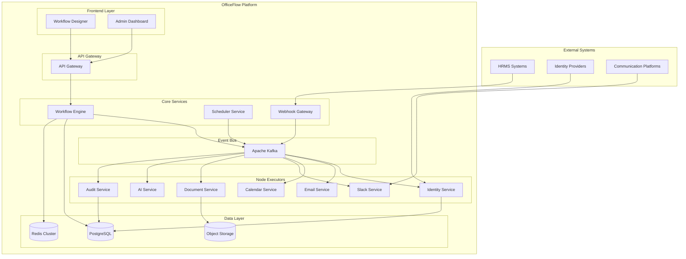

# OfficeFlow Platform Design Document

## Overview

OfficeFlow is an event-driven workflow automation platform designed to streamline corporate HR and IT processes through intelligent orchestration. The system employs a microservices architecture with Kafka-based event streaming, Redis-backed state management, and AI-enhanced decision making to automate complex business workflows while maintaining scalability, reliability, and compliance.

## Architecture

### High-Level Architecture

The platform follows a distributed, event-driven architecture with clear separation of concerns:



### Core Architectural Principles

1. **Event-Driven Design**: All system interactions flow through Kafka events, enabling loose coupling and asynchronous processing
2. **Microservices Pattern**: Each node type is implemented as an independent service for scalability and maintainability
3. **Stateless Orchestration**: The Workflow Engine maintains no local state, enabling horizontal scaling
4. **Idempotent Operations**: All node executions are designed to be safely retryable
5. **Eventual Consistency**: System prioritizes availability and partition tolerance with eventual consistency guarantees

## Components and Interfaces

### Frontend Components

#### Workflow Designer
- **Technology**: React 18 + TypeScript + React Flow + TailwindCSS
- **Purpose**: Visual workflow creation and editing interface
- **Key Features**:
  - Drag-and-drop node placement
  - Real-time workflow validation
  - Template management
  - Version control integration

#### Admin Dashboard
- **Technology**: React 18 + TypeScript + Recharts + TailwindCSS
- **Purpose**: System monitoring and management interface
- **Key Features**:
  - Workflow execution monitoring
  - Performance metrics visualization
  - User and organization management
  - Audit log viewing

### Core Services

#### Workflow Engine
- **Technology**: Node.js + TypeScript + Express.js
- **Purpose**: Central orchestration service for workflow execution
- **Key Responsibilities**:
  - Kafka event consumption and processing
  - DAG parsing and topological sorting
  - Node execution coordination
  - State management and persistence
  - Retry and error handling logic

**Interface Definition**:
```typescript
interface WorkflowEngine {
  processLifecycleEvent(event: LifecycleEvent): Promise<WorkflowRun>
  executeWorkflow(workflowId: string, context: ExecutionContext): Promise<WorkflowRun>
  pauseWorkflow(runId: string): Promise<void>
  resumeWorkflow(runId: string): Promise<void>
  cancelWorkflow(runId: string): Promise<void>
}

interface LifecycleEvent {
  type: 'employee.onboard' | 'employee.exit' | 'employee.transfer' | 'employee.update'
  organizationId: string
  employeeId: string
  payload: Record<string, any>
  timestamp: Date
}
```

#### Scheduler Service
- **Technology**: Node.js + TypeScript + node-cron
- **Purpose**: Time-based workflow triggering and recurring task management
- **Key Features**:
  - Cron-based scheduling
  - Timezone-aware execution
  - Distributed scheduling coordination

#### Webhook Gateway
- **Technology**: Node.js + TypeScript + Express.js
- **Purpose**: External system integration and event normalization
- **Key Features**:
  - Multi-format webhook ingestion
  - Event transformation and validation
  - Rate limiting and security

### Node Executor Services

All node executors implement a standardized interface for consistent orchestration:

```typescript
interface NodeExecutor {
  execute(input: NodeInput): Promise<NodeResult>
  validate(params: NodeParams): ValidationResult
  getSchema(): NodeSchema
}

interface NodeInput {
  nodeId: string
  runId: string
  organizationId: string
  employeeId: string
  params: Record<string, any>
  context: ExecutionContext
  idempotencyKey: string
}

interface NodeResult {
  status: 'success' | 'failed' | 'retry'
  output: Record<string, any>
  error?: ErrorDetails
  metadata: ExecutionMetadata
}
```

#### Identity Service
- **Technology**: Node.js + TypeScript + OAuth2 libraries
- **Integrations**: Okta, Google Workspace, Office 365, Active Directory
- **Capabilities**:
  - Account provisioning and deprovisioning
  - Group membership management
  - Permission assignment
  - SSO configuration

#### AI Service
- **Technology**: Node.js + TypeScript + OpenAI SDK
- **Integrations**: OpenAI GPT-4, Anthropic Claude, Azure OpenAI
- **Capabilities**:
  - Personalized content generation
  - Sentiment analysis
  - Document summarization
  - Recommendation generation

### Event Bus Architecture

#### Kafka Topic Design
```
Lifecycle Events:
- employee.onboard.{org_id}
- employee.exit.{org_id}
- employee.transfer.{org_id}
- employee.update.{org_id}

Workflow Control:
- workflow.run.request
- workflow.run.pause
- workflow.run.resume
- workflow.run.cancel

Node Execution:
- node.execute.request
- node.execute.result
- node.execute.retry

Integration Events:
- identity.provision.request
- identity.provision.result
- email.send.request
- email.send.result
- calendar.schedule.request
- calendar.schedule.result

Observability:
- audit.events
- metrics.events
- dlq.{topic_name}
```

#### Partitioning Strategy
- **Lifecycle Events**: Partitioned by `organization_id` for tenant isolation
- **Node Execution**: Partitioned by `organization_id:employee_id` for ordering guarantees
- **Audit Events**: Partitioned by `organization_id` for compliance isolation

## Data Models

### Core Entities

#### Organization
```sql
CREATE TABLE organizations (
    org_id UUID PRIMARY KEY,
    name VARCHAR(255) NOT NULL,
    domain VARCHAR(255) UNIQUE NOT NULL,
    plan VARCHAR(50) NOT NULL,
    settings JSONB DEFAULT '{}',
    created_at TIMESTAMP DEFAULT NOW(),
    updated_at TIMESTAMP DEFAULT NOW()
);
```

#### Workflow Definition
```sql
CREATE TABLE workflows (
    workflow_id UUID PRIMARY KEY,
    org_id UUID REFERENCES organizations(org_id),
    name VARCHAR(255) NOT NULL,
    event_trigger VARCHAR(100) NOT NULL,
    version INTEGER DEFAULT 1,
    is_active BOOLEAN DEFAULT true,
    definition JSONB NOT NULL,
    created_by UUID REFERENCES users(user_id),
    created_at TIMESTAMP DEFAULT NOW(),
    updated_at TIMESTAMP DEFAULT NOW()
);

CREATE TABLE workflow_nodes (
    node_id UUID PRIMARY KEY,
    workflow_id UUID REFERENCES workflows(workflow_id),
    type VARCHAR(50) NOT NULL,
    name VARCHAR(255) NOT NULL,
    params JSONB DEFAULT '{}',
    retry_policy JSONB DEFAULT '{"maxRetries": 3, "backoffMs": 1000}',
    timeout_ms INTEGER DEFAULT 300000,
    position JSONB DEFAULT '{}'
);

CREATE TABLE workflow_edges (
    edge_id UUID PRIMARY KEY,
    workflow_id UUID REFERENCES workflows(workflow_id),
    from_node_id UUID REFERENCES workflow_nodes(node_id),
    to_node_id UUID REFERENCES workflow_nodes(node_id),
    condition_expr TEXT,
    label VARCHAR(255)
);
```

#### Workflow Execution
```sql
CREATE TABLE workflow_runs (
    run_id UUID PRIMARY KEY,
    org_id UUID REFERENCES organizations(org_id),
    workflow_id UUID REFERENCES workflows(workflow_id),
    employee_id UUID REFERENCES employees(employee_id),
    trigger_event VARCHAR(100) NOT NULL,
    status VARCHAR(50) DEFAULT 'PENDING',
    context JSONB DEFAULT '{}',
    started_at TIMESTAMP DEFAULT NOW(),
    ended_at TIMESTAMP,
    error_details JSONB
);

CREATE TABLE node_runs (
    node_run_id UUID PRIMARY KEY,
    run_id UUID REFERENCES workflow_runs(run_id),
    node_id UUID REFERENCES workflow_nodes(node_id),
    attempt INTEGER DEFAULT 1,
    status VARCHAR(50) DEFAULT 'QUEUED',
    input JSONB,
    output JSONB,
    error_details JSONB,
    idempotency_key VARCHAR(255) UNIQUE,
    started_at TIMESTAMP,
    ended_at TIMESTAMP
);
```

### State Management Strategy

#### Redis Data Structures
```typescript
// Active workflow runs tracking
SET workflow:runs:active {run_id} {serialized_state}

// Node execution queues
LIST node:queue:{node_type} [{node_execution_request}]

// Retry scheduling
ZSET retry:schedule {score: retry_timestamp} {node_run_id}

// Rate limiting counters
HASH rate_limit:{org_id}:{provider} {window_start} {count}

// Distributed locks
SET lock:workflow:{run_id} {lock_holder} EX {ttl_seconds}
```

## Error Handling

### Retry Strategy
1. **Exponential Backoff**: Base delay of 1 second, multiplier of 2, maximum of 5 minutes
2. **Maximum Attempts**: 3 retries per node execution
3. **Jitter**: Random delay variation to prevent thundering herd
4. **Circuit Breaker**: Automatic failure detection and recovery for external services

### Compensation Flows
```typescript
interface CompensationNode {
  compensatesFor: string[] // Array of node IDs this compensates for
  compensationType: 'rollback' | 'cleanup' | 'notification'
  params: Record<string, any>
}
```

### Dead Letter Queue Processing
- Failed messages routed to topic-specific DLQ
- Automated retry with exponential backoff
- Manual intervention interface for persistent failures
- Quarantine mechanism for malformed messages

## Testing Strategy

### Unit Testing
- **Framework**: Jest + TypeScript
- **Coverage Target**: 90% code coverage
- **Focus Areas**:
  - Business logic validation
  - Error handling scenarios
  - State transition correctness
  - Integration point mocking

### Integration Testing
- **Framework**: Jest + Testcontainers
- **Test Environment**: Docker-based isolated services
- **Coverage**:
  - Kafka message flow validation
  - Database transaction integrity
  - External API integration contracts
  - End-to-end workflow execution

### Performance Testing
- **Framework**: Artillery.js + custom metrics
- **Test Scenarios**:
  - Concurrent workflow execution
  - High-volume event processing
  - Database query performance
  - Memory usage under load

### Security Testing
- **Authentication**: JWT token validation
- **Authorization**: RBAC enforcement
- **Data Protection**: Encryption at rest and in transit
- **Input Validation**: SQL injection and XSS prevention
- **API Security**: Rate limiting and CORS configuration

## Deployment Architecture

### Container Strategy
```dockerfile
# Multi-stage build for Node.js services
FROM node:18-alpine AS builder
WORKDIR /app
COPY package*.json ./
RUN npm ci --only=production

FROM node:18-alpine AS runtime
WORKDIR /app
COPY --from=builder /app/node_modules ./node_modules
COPY . .
EXPOSE 3000
CMD ["npm", "start"]
```

### Kubernetes Deployment
```yaml
apiVersion: apps/v1
kind: Deployment
metadata:
  name: workflow-engine
spec:
  replicas: 3
  selector:
    matchLabels:
      app: workflow-engine
  template:
    metadata:
      labels:
        app: workflow-engine
    spec:
      containers:
      - name: workflow-engine
        image: officeflow/workflow-engine:latest
        ports:
        - containerPort: 3000
        env:
        - name: KAFKA_BROKERS
          value: "kafka:9092"
        - name: POSTGRES_URL
          valueFrom:
            secretKeyRef:
              name: db-credentials
              key: url
        resources:
          requests:
            memory: "256Mi"
            cpu: "250m"
          limits:
            memory: "512Mi"
            cpu: "500m"
```

### Monitoring and Observability
- **Metrics**: Prometheus + Grafana
- **Logging**: Structured JSON logs with correlation IDs
- **Tracing**: OpenTelemetry with Jaeger backend
- **Alerting**: PagerDuty integration for critical failures
- **Health Checks**: Kubernetes liveness and readiness probes